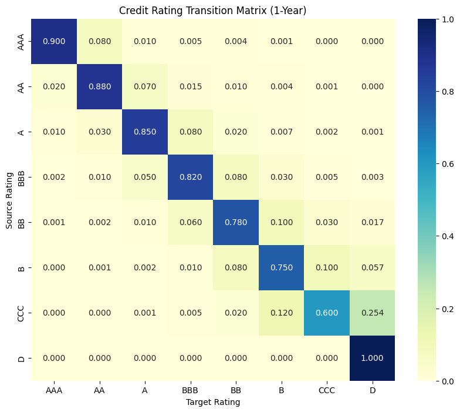

# Credit Rating Transition Simulation (Markov Chain)

This repository demonstrates a **Markov-chain based simulation of corporate credit rating migrations**.
Starting from a single rating (e.g. 100% BBB), the model visualizes:

- 1-year credit rating transition matrix  
- Sample rating trajectories for individual firms  
- Long-term evolution of the rating distribution  
- Cumulative default probability (PD) over time  

The project is designed as a **clear, reproducible educational and research-style example** for credit risk modeling.

---

## Model Overview

### Credit Ratings
We consider the following ordered rating states:

AAA → AA → A → BBB → BB → B → CCC → D


- `D` (Default) is modeled as an **absorbing state**
- Rating transitions follow a **time-homogeneous Markov process**
- Transition probabilities are illustrative but realistic, inspired by rating-agency statistics

---

## 1-Year Transition Matrix

The matrix below shows the probability of migrating from one rating to another over one year.



**Key observations**
- Strong diagonal dominance for investment-grade ratings (AAA–BBB)
- Increasing downgrade and default probabilities in speculative grades
- Default (`D`) is absorbing (100% stay in default)

---

## Sample Rating Trajectories (BBB Start)

The following figure shows **five simulated 20-year rating paths** for a firm initially rated BBB.


**Interpretation**
- Rating paths are highly path-dependent
- Firms may experience temporary upgrades before eventual deterioration
- Once default is reached, the firm remains in state `D`
- Even identical starting ratings can lead to vastly different outcomes

---

## Projected Rating Distribution Over Time

Starting from **100% BBB**, we project the cross-sectional distribution of ratings over 30 years.


**Insights**
- Mass gradually shifts from BBB toward lower ratings
- Default probability increases steadily over time
- Investment-grade ratings persist for a non-trivial fraction even in the long run

---

## Cumulative Default Probability (from BBB)

Using the projected distribution:

| Horizon | Cumulative PD |
|-------:|--------------:|
| 1 year | 0.30% |
| 5 years | 5.23% |
| 10 years | 16.43% |
| 20 years | 39.13% |

This highlights how **long-horizon credit risk is dominated by transition dynamics**, not just short-term PD.

---

## How to Run

```bash
pip install -r requirements.txt
python src/simulate.py --seed 42 --start BBB
```
Outputs are saved automatically to the outputs/ directory.

---
## Assumptions & Limitations

- Transition matrix is time-invariant
- No macroeconomic or firm-specific covariates
- No recovery modeling after default
- Annual transition frequency
- These simplifications are intentional for clarity and extensibility.

## Possible Extensions

- Time-varying transition matrices (business cycle effects)
- Rating-based pricing of corporate bonds
- Expected time-to-default (absorbing Markov analysis)
- Comparison with empirical rating-agency data
- Stress scenarios (transition matrix perturbation)

## Motivation

- This project was created to:
- Build intuition for credit migration risk
- Provide a clean example of absorbing Markov chains
- Serve as a portfolio-ready demonstration for quantitative finance roles

## Disclaimer

This code is for educational and illustrative purposes only and should not be used directly for investment or risk management decisions.
